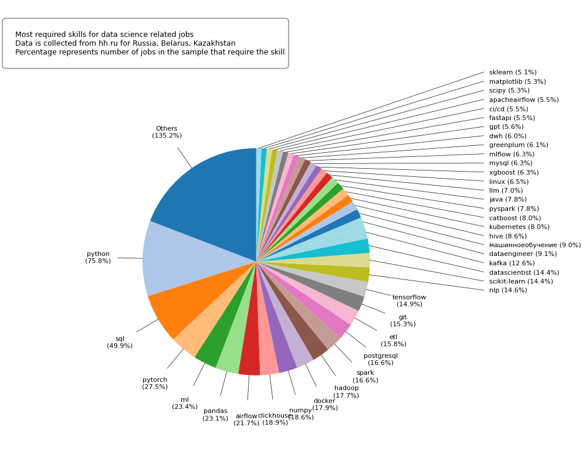
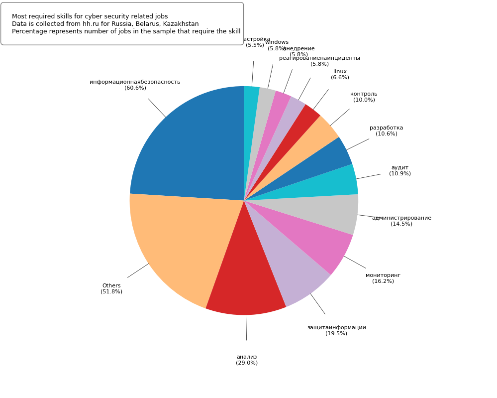
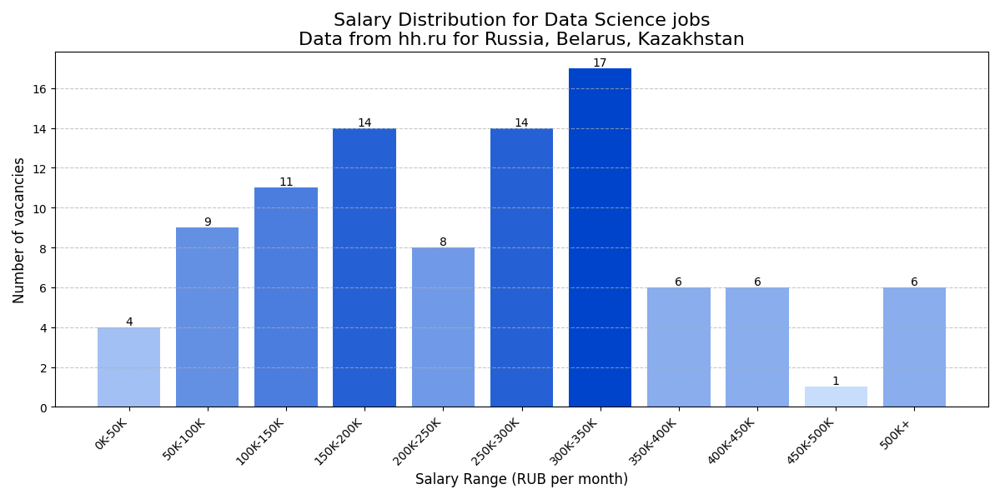
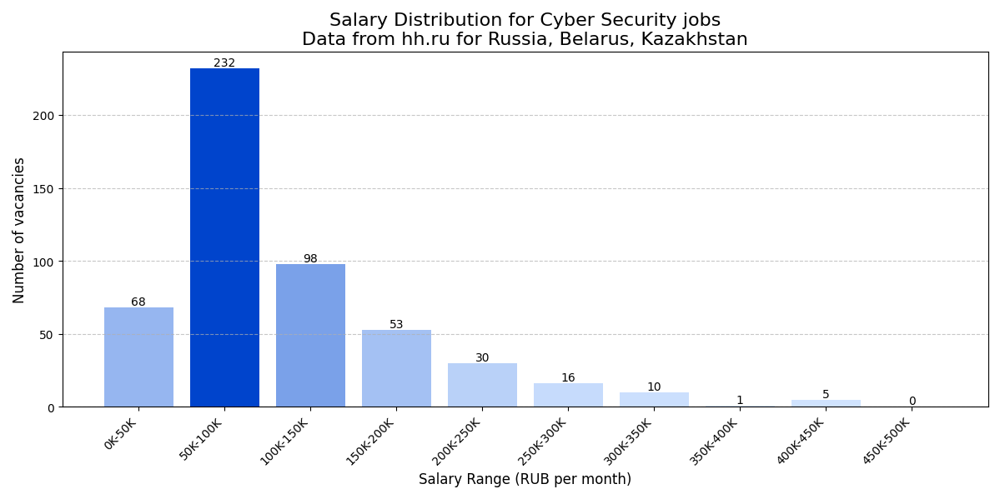

## Bonus assignment for Data wrangling and visualization course

Two pie charts represent skills required for jobs related with data science and cyber security.

Another two bar charts represent salary distribution offered in these fields.

All job postings were collected from hh.ru with region set to Russia, Belarus, and Kazakhstan

For identification of required skills gemini was used. The site already provides required skills box, but absolute majority of vacancies don't use it.
And those that do often have it incomplete or inaccurate.

Most jobs also don't provide salary range, so only ones that do were considered for salary charts.
